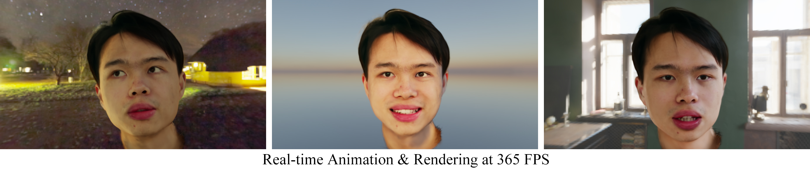
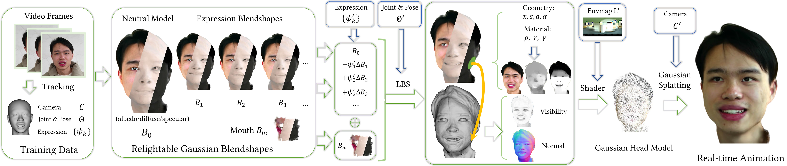

# Relightable Gaussian Blendshapes  
**[Paper](TBD) | [Project Page](TBD)**  





Official PyTorch implementation of the paper "Relightable Gaussian Blendshapes for Head Avatar Animation".  

# Setup  

Tested on Nvidia RTX 3090/4090. Since our project relies on OptiX, we don’t recommend professional compute cards, which lack ray tracing hardware and fall back to slower software ray tracing.   

Clone the code and create the environment:

```shell
git clone https://github.com/zjumsj/RelightableGaussianBlendshapes  
cd RelightableGaussianBlendshapes

# create env using conda  
conda create -n relightableGB python=3.9
conda activate relightableGB
```

Make sure [CUDA 11.8](https://developer.nvidia.com/cuda-11-8-0-download-archive) is installed, and install PyTorch:    
```shell  
pip install torch==2.0.0 torchvision==0.15.1 --index-url https://download.pytorch.org/whl/cu118  
```

Install the following packages:  
```shell  
pip install ./submodules/diff-gaussian-rasterization
pip install ./submodules/simple-knn
pip install git+https://github.com/lxxue/FRNN.git@efc6b37
pip install git+https://github.com/zjumsj/diff_envshade.git
```
Install [torchoptixext_visibility](https://github.com/zjumsj/torchoptixext_visibility) and [PyTorch3D](https://github.com/facebookresearch/pytorch3d/blob/main/INSTALL.md) following their instructions.  

Install the remaining packages  

```shell
pip install -r requirements.txt  
```

Our Gaussian blendshapes are initialized from FLAME model. You need to create an account on the [FLAME website](https://flame.is.tue.mpg.de/download.php) and download FLAME 2020 model. Please unzip FLAME2020.zip and put generic_model.pkl under ./data/FLAME2020. 

## Dataset  

### Real dataset

Our real-captured dataset is based on [GaussianBlendshapes](https://github.com/zjumsj/GaussianBlendshapes). The preprocessed data can be download [here](https://zjueducn-my.sharepoint.com/:f:/g/personal/3140103086_zju_edu_cn/Egvkvtjac5NJg7_49vmuxysBiWYM-HRINk5un44C3SXdxw). 

In addition to their dataset, we require extra semantic segmentations. The segment masks can be directly downloaded from [here](https://mega.nz/file/ikR0RZKS#lKJXhauYfAwhX1JL7uwq8kxdaCJWdRx3dzaJhwzRcdQ). Run ```python scripts/patch_dataset.py -i /path/to/semantic.zip -o /path/to/dataset/folder``` to insert the segment masks into the original dataset. These segment masks are generated by the preprocessing script of [IMAvatar](https://github.com/zhengyuf/IMavatar) and you can also generate them yourself.  

### Synthetic dataset

Our synthetic dataset is generated using UE’s MetaHuman. You can find the preprocessed dataset [here](https://mega.nz/folder/i45EVTZb#Xz-JH9WWKsp-0S-l7bGQ1Q).   

If you are interested in generating your own dataset, you can refer to [GaussianBlendshapes](https://github.com/zjumsj/GaussianBlendshapes) and use the preprocessing script of [IMAvatar](https://github.com/zhengyuf/IMavatar) for semantic segmentation.

## Training  

Our training is divided into two stages: geometry optimization and Gaussian optimization.  

```shell
# Stage 1, geometry optimization  
TODO1
# Stage 2, Gaussian optimization  
TODO2
```  

Optimization performed without considering visibility  

```shell
# Stage 2, Gaussian optimization  
TODO3
```

## Evaluation  

## Citation  

```
@inproceedings{ma2025relightable,
  title={Relightable Gaussian Blendshapes for Head Avatar Animation},
  author={Ma, Shengjie and Zheng, Youyi and Weng, Yanlin and Zhou, Kun},
  booktitle={International Conference on Computer-Aided Design and Compute Graphics},
  year={2025}
}
```